# Insurance Loss Prediction: GBM vs GLM

This project compares **GBM models (XGBoost/LightGBM)** vs **GLM** for insurance severity prediction using public datasets.  
It demonstrates that ML models can reduce **prediction error**  with small the Gini gain.

---

## 🎯 Key Objectives
- Compare GLM vs GBM performance for loss modeling  
- Evaluate error distribution, calibration, and model stability  
- Use SHAP to understand nonlinear patterns missed by GLM  
- Provide a reproducible, end-to-end pipeline

---

## 📊 Main Findings
- ML improves **prediction error** even with small Gini gain  
- GBM captures nonlinear effects GLM cannot  
- Calibration significantly improves distribution alignment  
- SHAP explains feature contributions and tail behavior

## 📊 Dataset Description

**Source:** [Kaggle Medical Insurance Cost Prediction Dataset](https://www.kaggle.com/datasets/mohankrishnathalla/medical-insurance-cost-prediction)

**Size:** 100,000 rows × 54 columns

**Target Variable:** `total_claims_paid` (continuous, amount paid in insurance claims)

**Missing Data:** 30,083 missing values across various features (handled during preprocessing)

## �🖼️ Screenshots

### Main Prediction App

#### Prediction Interface
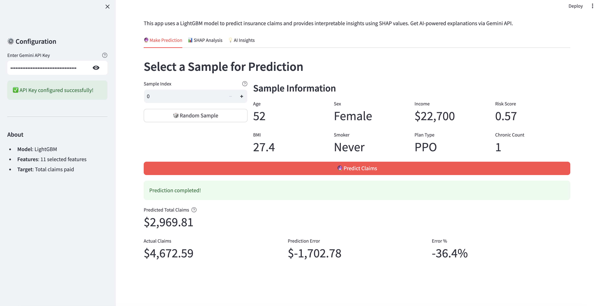

#### SHAP Analysis
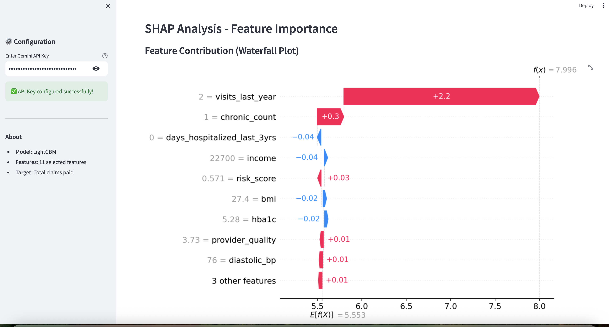

#### AI Insights
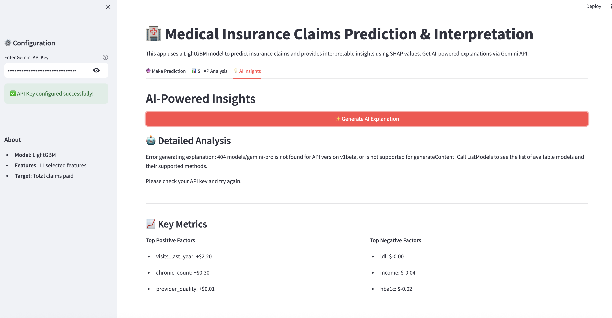

### Fairness Analysis App

#### Group Comparison
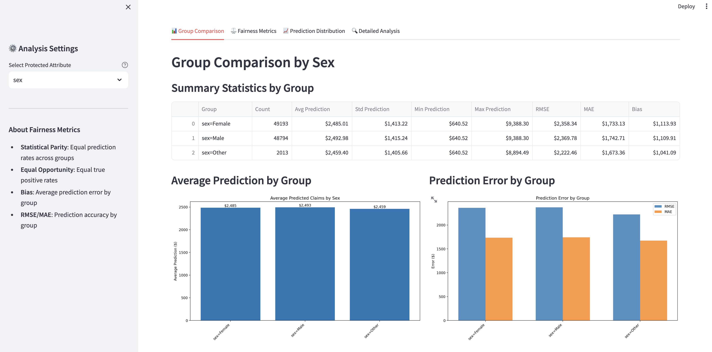

#### Fairness Metrics
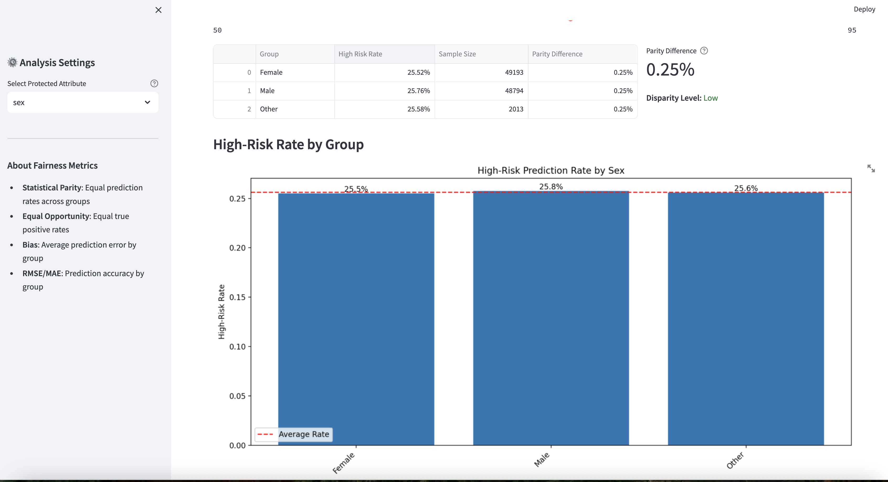

#### Prediction Distribution
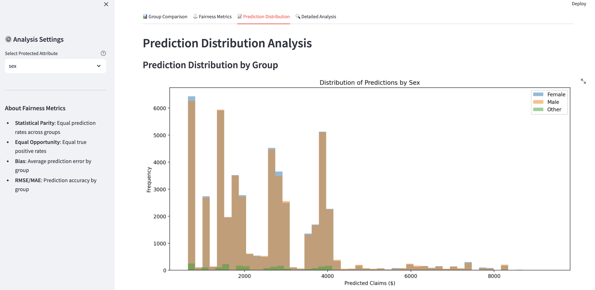

#### Detailed Analysis
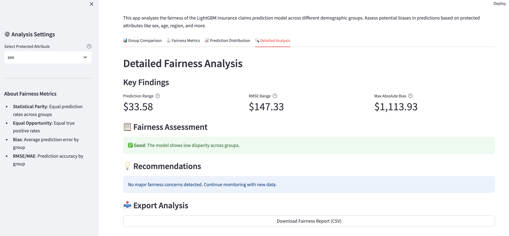

### Data & Model Monitoring Dashboard

#### Data Quality and Distribution Monitoring
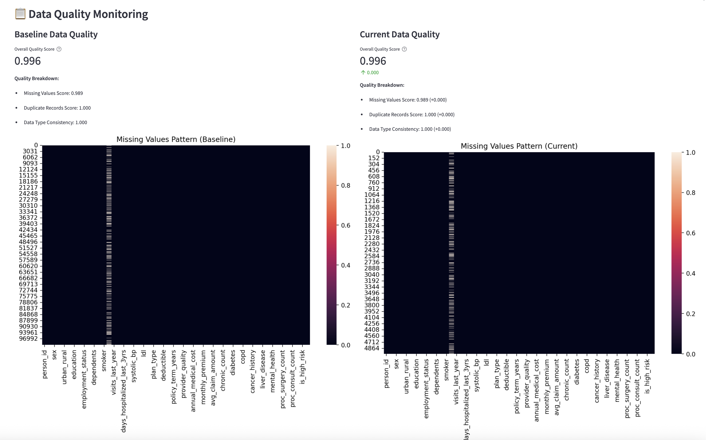
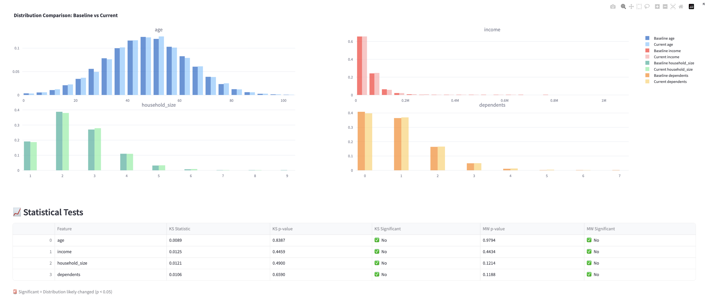

#### Drift Detection (PSI Analysis)
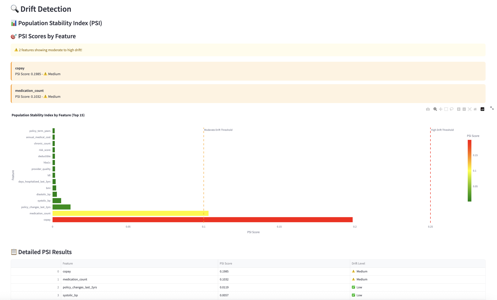

#### Model Performance Tracking
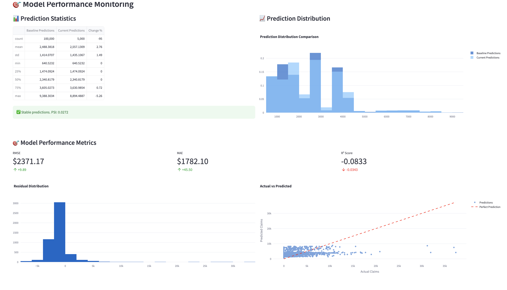

#### Real-time Alerts
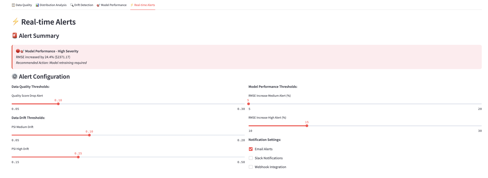

## 🚀 Quick Start

### Installation

```bash
# Install dependencies
pip install -r requirements.txt
```

### Running the Apps

**Main Prediction App:**
```bash
streamlit run app.py
```
Opens at: http://localhost:8501

**Fairness Analysis App:**
```bash
streamlit run fairness_app.py
```
Opens at: http://localhost:8502

**Data & Model Monitoring Dashboard:**
```bash
streamlit run monitoring_app.py
```
Opens at: http://localhost:8503

## 📊 Applications

## 📊 Applications

### 1. Main Prediction App (`app.py`)

**Features:**
- 🔮 **Prediction Tab**: Get claims predictions for individual patients
- 📊 **SHAP Analysis Tab**: Visualize feature contributions with waterfall plots
- 💡 **AI Insights Tab**: Generate natural language explanations (requires Gemini API key)

**Usage:**
1. Select a sample or use random selection
2. View patient demographics and health metrics
3. Get instant predictions with detailed explanations
4. Understand which features drive the prediction

### 2. Fairness Analysis App (`fairness_app.py`)

**Features:**
- ⚖️ **Group Comparison**: Compare predictions across demographic groups
- 📈 **Fairness Metrics**: Statistical parity and disparity analysis
- 📊 **Distribution Analysis**: Visualize prediction distributions by group
- 🔍 **Detailed Reports**: Exportable fairness assessments

**Usage:**
1. Select a protected attribute (sex, age, region, education, etc.)
2. Analyze prediction differences across groups
3. Review statistical parity and bias metrics
4. Export fairness reports as CSV

### 3. Data & Model Monitoring Dashboard (`monitoring_app.py`) 🆕

**Features:**
- 📋 **Data Quality Monitoring**: Track missing values, outliers, and data type consistency
- 📊 **Distribution Analysis**: Compare baseline vs current data with statistical tests
- 🔍 **Drift Detection**: Population Stability Index (PSI) calculation for all features
- 🎯 **Model Performance Tracking**: Monitor RMSE, MAE, prediction drift, and residual analysis
- ⚡ **Real-time Alerts**: Configurable thresholds with actionable recommendations

**Usage:**
1. Upload current/production dataset via sidebar
2. **Data Quality Tab**: Compare data quality scores and identify issues
3. **Distribution Analysis Tab**: Run Kolmogorov-Smirnov and Mann-Whitney U tests
4. **Drift Detection Tab**: Monitor PSI scores and feature-level drift analysis
5. **Model Performance Tab**: Track prediction accuracy and detect model degradation
6. **Real-time Alerts Tab**: Configure alert thresholds and review recommendations

**Drift Detection Levels:**
- 🟢 **Stable** (PSI < 0.1): No action needed
- 🟡 **Moderate Drift** (PSI 0.1-0.25): Monitor closely
- 🔴 **High Drift** (PSI > 0.25): Investigation and potential retraining required

**Demo Datasets Available:**
- `deployment_data/stable_deployment_data.csv` - Normal production scenario
- `deployment_data/moderate_drift_data.csv` - Gradual population changes  
- `deployment_data/high_drift_data.csv` - Significant demographic shifts
- `deployment_data/data_quality_issues.csv` - Missing values and outliers
- `deployment_data/performance_degradation_data.csv` - Model accuracy decline

## 🧠 Model Information

- **Algorithm**: LightGBM Regressor
- **Target Variable**: `total_claims_paid`
- **Features**: 12 selected features
  - `visits_last_year`, `chronic_count`, `ldl`, `income`, `hba1c`, `bmi`
  - `provider_quality`, `systolic_bp`, `diastolic_bp`, `risk_score`
  - `days_hospitalized_last_3yrs`, `policy_term_years`
- **Feature Selection**: Random Forest importance ranking
- **Evaluation**: RMSE, MAE, Gini coefficient, lift charts

## 📁 Project Structure

```
├── app.py                              # Main prediction & interpretation app
├── fairness_app.py                     # Model fairness analysis app
├── monitoring_app.py                   # Data & model monitoring dashboard
├── generate_deployment_data.py         # Script to create test datasets
├── insurance_claim_analysis.ipynb      # Model training & analysis notebook
├── lightgbm_model.pkl                  # Trained model (exported from notebook)
├── medical_insurance.csv               # Dataset
├── requirements.txt                    # Python dependencies
├── runtime.txt                         # Python version for deployment
├── render.yaml                         # Render deployment configuration
├── start_main_app.sh                   # Startup script for main app
├── start_fairness_app.sh               # Startup script for fairness app
├── start_monitoring_app.sh             # Startup script for monitoring app
├── DEPLOY.md                           # Deployment guide
├── README.md                           # Project documentation
├── deployment_data/                    # Test datasets for monitoring
│   ├── README.md                       # Dataset documentation
│   ├── stable_deployment_data.csv      # Normal production data
│   ├── moderate_drift_data.csv         # Moderate drift scenario
│   ├── high_drift_data.csv             # High drift scenario
│   ├── data_quality_issues.csv         # Data quality problems
│   └── performance_degradation_data.csv # Model performance decline
└── screenshots/                        # App screenshots
    ├── prediction_tab.png
    ├── shap_analysis.png
    ├── ai_insights.png
    ├── fairness_group_comparison.png
    ├── fairness_metrics.png
    ├── fairness_distribution.png
    ├── fairness_detailed.png
    ├── monitoring_data_quality.png
    ├── monitoring_drift_detection.png
    ├── monitoring_model_performance.png
    └── monitoring_alerts.png
```

## 🔑 Gemini API Setup (Optional)

For AI-powered insights in the main app:

1. Visit https://ai.google.dev/
2. Create a free API key
3. Enter the key in the app sidebar
4. Generate natural language explanations with highlighted factors

## 📈 Key Features

### Interpretability
- **SHAP Values**: Understand individual predictions
- **Feature Importance**: See which factors matter most
- **Waterfall Plots**: Visualize positive/negative contributions

### Fairness Analysis
- **Statistical Parity**: Measure equal treatment across groups
- **Bias Detection**: Identify systematic prediction differences
- **Group Comparisons**: Analyze performance by demographics
- **Actionable Recommendations**: Get suggestions for fairness improvements

### CI/CD Monitoring
- **Data Drift Detection**: Population Stability Index (PSI) monitoring
- **Data Quality Tracking**: Missing values, outliers, type consistency
- **Model Performance Monitoring**: Accuracy degradation detection
- **Real-time Alerts**: Configurable thresholds with severity levels
- **Statistical Testing**: Kolmogorov-Smirnov and Mann-Whitney U tests

### User Experience
- **Interactive Dashboards**: Easy-to-use Streamlit interfaces
- **Real-time Predictions**: Instant results
- **Export Capabilities**: Download fairness reports
- **Visual Analytics**: Comprehensive charts and plots
