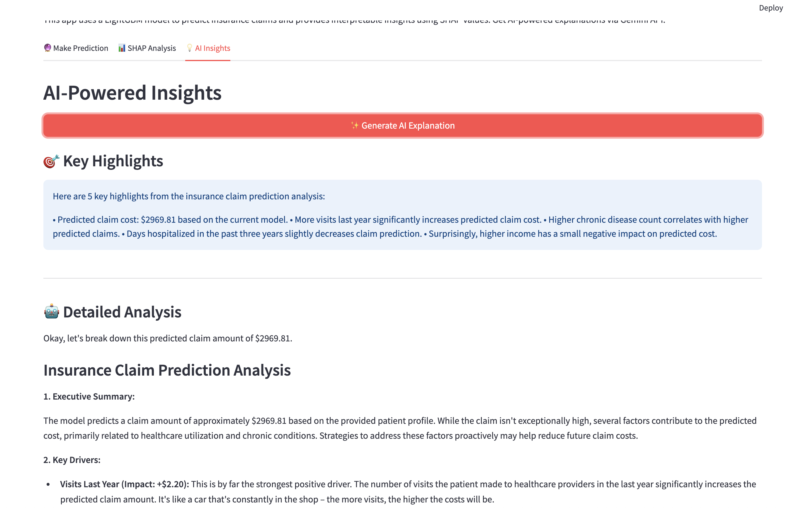
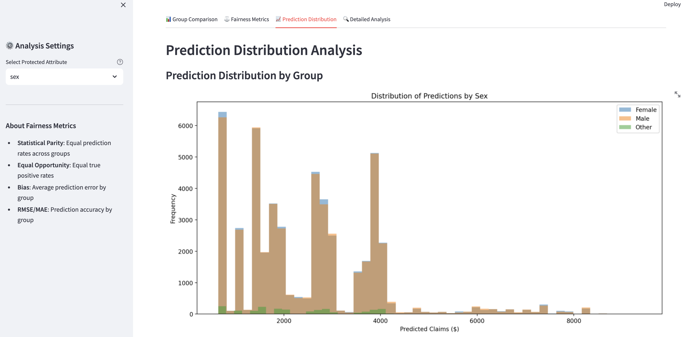

# Medical Insurance Claims Prediction

A machine learning project for predicting medical insurance claims with interpretable AI and fairness analysis.

## 📋 Overview

This project uses a **Kaggle medical insurance dataset** to predict **total_claims_paid** for patients based on demographics, health metrics, and claims history. The project includes:

- **LightGBM model** with 12 selected features
- **Interactive Streamlit apps** for predictions, interpretability, and fairness analysis
- **SHAP explanations** for model transparency
- **AI-powered insights** via Google's Gemini API
- **Fairness analysis** across demographic groups

## 📊 Dataset Description

**Source:** [Kaggle Medical Insurance Cost Prediction Dataset](https://www.kaggle.com/datasets/mohankrishnathalla/medical-insurance-cost-prediction)

**Size:** 100,000 rows × 54 columns

**Target Variable:** `total_claims_paid` (continuous, amount paid in insurance claims)

**Missing Data:** 30,083 missing values across various features (handled during preprocessing)

### Key Features (54 total):

**Demographics:**
- `age`, `sex`, `region`, `urban_rural`, `education`, `marital_status`, `employment_status`
- `household_size`, `dependents`, `income`

**Health Metrics:**
- `bmi`, `systolic_bp`, `diastolic_bp`, `ldl`, `hba1c`
- `smoker`, `alcohol_freq`

**Medical History:**
- `visits_last_year`, `hospitalizations_last_3yrs`, `days_hospitalized_last_3yrs`
- `medication_count`, `chronic_count`
- Binary indicators: `hypertension`, `diabetes`, `asthma`, `copd`, `cardiovascular_disease`, 
  `cancer_history`, `kidney_disease`, `liver_disease`, `arthritis`, `mental_health`

**Insurance Details:**
- `plan_type`, `network_tier`, `deductible`, `copay`, `policy_term_years`
- `policy_changes_last_2yrs`, `provider_quality`, `risk_score`

**Medical Procedures:**
- `proc_imaging_count`, `proc_surgery_count`, `proc_physio_count`, `proc_consult_count`, `proc_lab_count`
- `is_high_risk`, `had_major_procedure`

**Data Types:**
- Integer (31 features)
- Float (13 features)  
- Categorical (10 features)

## 🎯 Model Performance

### Training Configuration
- **Training Set:** 80,000 samples (80%)
- **Test/Validation Set:** 20,000 samples (20%)
- **Feature Selection:** Top 12 features selected via Random Forest importance

### Final Model Metrics (LightGBM)

**Test Set Performance:**
- **RMSE:** $1,905.67
- **MAE:** $1,027.30

**Training Set Performance:**
- **RMSE:** $1,930.50 (at best iteration)

**Model Characteristics:**
- **Best Iteration:** 95 (out of 100 max iterations)
- **Early Stopping:** Applied with patience of 10 rounds
- **Low Overfitting:** Training RMSE ($1,930.50) ≈ Validation RMSE ($1,905.67)

### Baseline Comparison (GLM with Tweedie Distribution)

**GLM Performance:**
- **RMSE:** $7,937.49
- **MAE:** $1,279.41

**Improvement:** LightGBM achieves **76% reduction in RMSE** compared to GLM baseline

### Selected Features (12 Final Features)

The model uses these 12 features ranked by importance:
1. `visits_last_year` - Number of medical visits
2. `chronic_count` - Count of chronic conditions
3. `ldl` - LDL cholesterol level
4. `income` - Annual income
5. `hba1c` - Blood sugar control metric
6. `bmi` - Body Mass Index
7. `provider_quality` - Healthcare provider rating
8. `systolic_bp` - Systolic blood pressure
9. `diastolic_bp` - Diastolic blood pressure
10. `risk_score` - Calculated risk assessment
11. `days_hospitalized_last_3yrs` - Recent hospitalization days
12. `policy_term_years` - Insurance policy duration

## �🖼️ Screenshots

### Main Prediction App

#### Prediction Interface


#### SHAP Analysis


#### AI Insights


### Fairness Analysis App

#### Group Comparison


#### Fairness Metrics


#### Prediction Distribution


#### Detailed Analysis


## 🚀 Quick Start

### Installation

```bash
# Install dependencies
pip install -r requirements.txt
```

### Running the Apps

**Main Prediction App:**
```bash
streamlit run app.py
```
Opens at: http://localhost:8501

**Fairness Analysis App:**
```bash
streamlit run fairness_app.py
```
Opens at: http://localhost:8505

## 📊 Applications

### 1. Main Prediction App (`app.py`)

**Features:**
- 🔮 **Prediction Tab**: Get claims predictions for individual patients
- 📊 **SHAP Analysis Tab**: Visualize feature contributions with waterfall plots
- 💡 **AI Insights Tab**: Generate natural language explanations (requires Gemini API key)

**Usage:**
1. Select a sample or use random selection
2. View patient demographics and health metrics
3. Get instant predictions with detailed explanations
4. Understand which features drive the prediction

### 2. Fairness Analysis App (`fairness_app.py`)

**Features:**
- ⚖️ **Group Comparison**: Compare predictions across demographic groups
- 📈 **Fairness Metrics**: Statistical parity and disparity analysis
- 📊 **Distribution Analysis**: Visualize prediction distributions by group
- 🔍 **Detailed Reports**: Exportable fairness assessments

**Usage:**
1. Select a protected attribute (sex, age, region, education, etc.)
2. Analyze prediction differences across groups
3. Review statistical parity and bias metrics
4. Export fairness reports as CSV

## 🧠 Model Information

- **Algorithm**: LightGBM Regressor
- **Target Variable**: `total_claims_paid`
- **Features**: 12 selected features
  - `visits_last_year`, `chronic_count`, `ldl`, `income`, `hba1c`, `bmi`
  - `provider_quality`, `systolic_bp`, `diastolic_bp`, `risk_score`
  - `days_hospitalized_last_3yrs`, `policy_term_years`
- **Feature Selection**: Random Forest importance ranking
- **Evaluation**: RMSE, MAE, Gini coefficient, lift charts

## 📁 Project Structure

```
├── app.py                              # Main prediction & interpretation app
├── fairness_app.py                     # Model fairness analysis app
├── insurance_claim_analysis.ipynb      # Model training & analysis notebook
├── lightgbm_model.pkl                  # Trained model (exported from notebook)
├── medical_insurance.csv               # Dataset
├── requirements.txt                    # Python dependencies
├── README.md                           # Project documentation
└── screenshots/                        # App screenshots
    ├── prediction_tab.png
    ├── shap_analysis.png
    └── ai_insights.png
```

## 🔑 Gemini API Setup (Optional)

For AI-powered insights in the main app:

1. Visit https://ai.google.dev/
2. Create a free API key
3. Enter the key in the app sidebar
4. Generate natural language explanations with highlighted factors

## 📈 Key Features

### Interpretability
- **SHAP Values**: Understand individual predictions
- **Feature Importance**: See which factors matter most
- **Waterfall Plots**: Visualize positive/negative contributions

### Fairness Analysis
- **Statistical Parity**: Measure equal treatment across groups
- **Bias Detection**: Identify systematic prediction differences
- **Group Comparisons**: Analyze performance by demographics
- **Actionable Recommendations**: Get suggestions for fairness improvements

### User Experience
- **Interactive Dashboards**: Easy-to-use Streamlit interfaces
- **Real-time Predictions**: Instant results
- **Export Capabilities**: Download fairness reports
- **Visual Analytics**: Comprehensive charts and plots

## 📝 Notes

- Model and data files must be in the same directory as the apps
- SHAP calculations may take a few seconds
- Gemini API requires internet connection
- Keep API keys secure and never commit them to version control
- Fairness analysis works with or without ground truth labels

## 🛠️ Development

The project workflow:
1. **Data exploration** in Jupyter notebook
2. **Feature engineering** and selection
3. **Model training** with LightGBM
4. **Model export** to pickle file
5. **App development** for deployment
6. **Fairness evaluation** across groups

## 📚 Resources

- [LightGBM Documentation](https://lightgbm.readthedocs.io/)
- [SHAP Library](https://shap.readthedocs.io/)
- [Streamlit Documentation](https://docs.streamlit.io/)
- [Google Gemini API](https://ai.google.dev/)

## ⚖️ Fairness & Ethics

This project includes comprehensive fairness analysis tools to ensure responsible AI deployment. Always:
- Review predictions for potential bias
- Validate fairness across protected groups
- Consider the societal impact of automated decisions
- Use fairness metrics alongside performance metrics

## ⚠️ Limitations

### Model Limitations
- **Generalization**: Model trained on specific Kaggle dataset may not generalize to all insurance populations
- **Feature Dependencies**: Performance depends on availability of all 12 input features
- **Temporal Validity**: Model may require retraining as healthcare costs and patterns evolve over time
- **Missing Data**: 30% of original data contains missing values, which may introduce bias

### Fairness Limitations
- **Protected Attributes**: Not all potential sources of bias may be captured in the fairness analysis
- **Intersectionality**: Single-attribute fairness analysis doesn't capture compound discrimination effects
- **Correlation**: Some features may be proxies for protected attributes (e.g., zip code as proxy for race)
- **Ground Truth**: Fairness metrics assume historical claims data is unbiased

### Technical Limitations
- **Interpretability Trade-off**: SHAP explanations are approximations and may not capture all model behavior
- **API Dependency**: AI insights require external Gemini API with rate limits and costs
- **Computational Cost**: Real-time SHAP calculations may be slow for large-scale deployments
- **Single Model**: Only LightGBM is deployed; ensemble approaches might improve robustness

## 🔮 Future Work

### Model Improvements
- **Ensemble Methods**: Combine multiple algorithms (XGBoost, CatBoost, Neural Networks) for better predictions
- **Hyperparameter Optimization**: Systematic tuning using Optuna or similar frameworks
- **Feature Engineering**: Create interaction terms and polynomial features for complex relationships
- **Time Series Components**: Incorporate temporal trends in healthcare costs
- **Uncertainty Quantification**: Add prediction intervals using conformal prediction or quantile regression

### Fairness Enhancements
- **Intersectional Fairness**: Analyze fairness across multiple protected attributes simultaneously
- **Bias Mitigation**: Implement pre-processing, in-processing, or post-processing debiasing techniques
- **Causal Analysis**: Use causal inference to identify and remove discriminatory pathways
- **Counterfactual Explanations**: Generate "what-if" scenarios for fairer predictions
- **Continuous Monitoring**: Set up automated fairness drift detection in production

### Application Features
- **Batch Predictions**: Support CSV upload for multiple predictions at once
- **Model Versioning**: Track and compare different model versions
- **A/B Testing Framework**: Compare models in production with statistical significance testing
- **Custom Dashboards**: Allow users to create personalized monitoring dashboards
- **Alert System**: Notify when predictions indicate high-risk cases
- **Mobile App**: Develop native mobile applications for broader accessibility

### Data & Infrastructure
- **Real-time Updates**: Implement online learning for continuous model adaptation
- **Data Pipeline**: Automate data ingestion, validation, and preprocessing
- **Model Registry**: Use MLflow or similar for experiment tracking and model management
- **API Development**: Create REST API for programmatic access
- **Docker Deployment**: Containerize applications for easier deployment
- **Cloud Hosting**: Deploy on AWS/GCP/Azure with auto-scaling capabilities

### Research Extensions
- **Survival Analysis**: Predict time-to-next-claim using Cox proportional hazards models
- **Claim Type Classification**: Multi-class classification for different claim categories
- **Fraud Detection**: Identify potentially fraudulent claims
- **Cost Optimization**: Recommend interventions to reduce future healthcare costs
- **Personalized Medicine**: Integrate genomic data for precision health predictions
